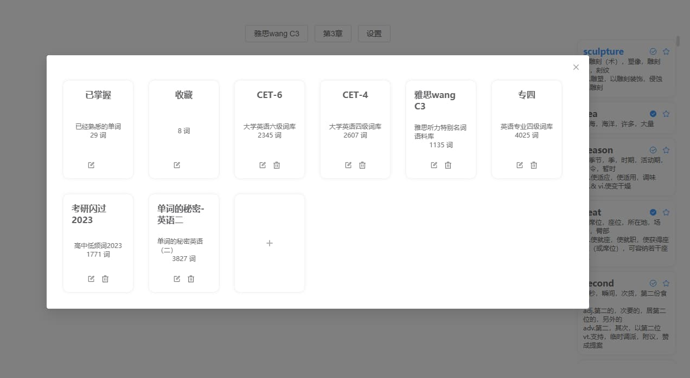

<h1 align="center">
  Handle Words
</h1>

### 背单词
可以选择记忆或默写单词，提供了音标显示、发音功能（均可选美音、英音），提供收藏功能，纯前端项目,可以自选单词本、设置章节单词，切换主题等功能。

### 拼写
点击下划线，敲击单词（输入正确显示绿色），敲击空格（切换下一个/显示提示）

### 功能展示


<div align=center>

</div>
### 选择章节
<div align=center>

</div>
### 添加词典
<div align=center>

</div>

### 个人词典
<div align=center>

</div>
<div align=center>

</div>

### 暗黑主题
<div align=center>

</div>

### 词库
内置了常用的 CET-4 、CET-6 、GMAT 、GRE 、IELTS 、SAT 、TOEFL 、考研英语、专业四级英语、专业八级英语，也有程序员常见英语单词以及多种编程语言 API 等词库。 尽可能满足大部分用户对背单词的需求，也非常欢迎社区贡献更多的词库。

### 设计理念

参考 墨墨背单词、扇贝单词、森林单词、句乐部等。省略艾宾浩斯遗忘曲线，并不是说它不好而是随着时间的推移背的越多复习的越多，必须长期持续的记忆和复习，最后可能背需要复习海量词汇淹没，因此在设计之初就省去复习的功能，回归到最简单的听、读、写状态。所谓知之为知之不知为不知，凡是你熟知一个单词，那你肯定能拼写出来，你能拼写出来就能够读出来。至于哪些是自己熟知的单词只有自己最清楚。

## 运行项目

本项目是基于`Vue`开发的，需要 node 环境来运行。

### 手动安装
#### Vue 3 + Vite 7 +  node v22.15.1
1. 安装 NodeJS，参考[官方文档](https://nodejs.org/en/download)
2. 使用 `git clone` 下载项目到本地, 不使用 git 可能因为缺少依赖而无法运行
3. 打开命令行，在项目根目录下，运行`npm install`来下载依赖。
4. 执行`npm run dev`来启动项目，项目默认地址为[`http://localhost:5173`](http://localhost:5173)
5. 在浏览器中打开[`http://localhost:5173`](http://localhost:5173)  来访问项目。


### 词典介绍

```js
  {
    id: 'cet4',
    name: 'CET-4',
    description: '大学英语四级词库',
    category: '中国考试',
    tags: ['大学英语'],
    translateLanguage: 'common',  //common采用自带的词库进行翻译
    length: 2607,
    language: 'en',
    type: 'word'     //对应myDictList里面词汇  word：自选添加的词汇本，grasp：已掌握的词汇，collect：收藏的词汇
    url: 'CET4_T.json', //通过 language/type/url  定位词典
  },
```


### 特别感谢：
[typing-word](https://github.com/zyronon/typing-word)
[qwerty-learner](https://github.com/RealKai42/qwerty-learner/) 